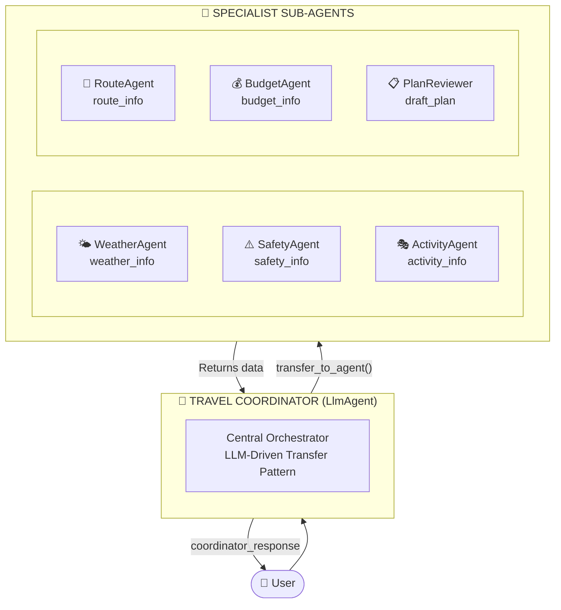
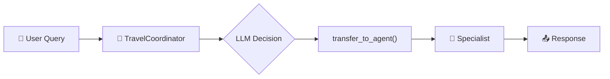
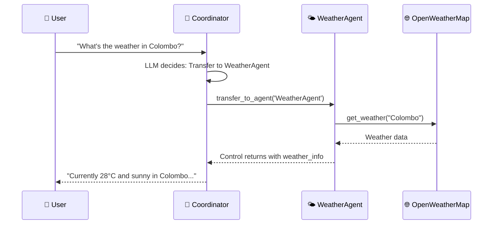
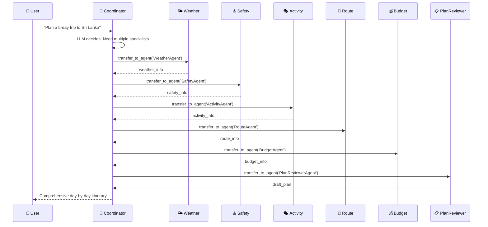
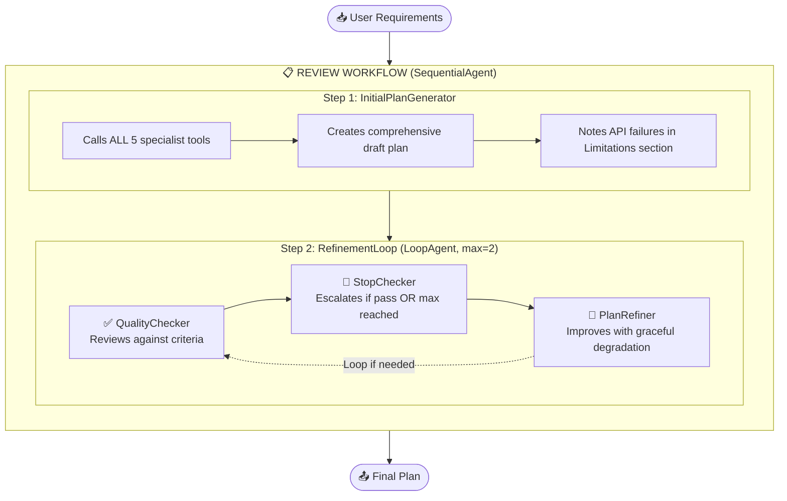
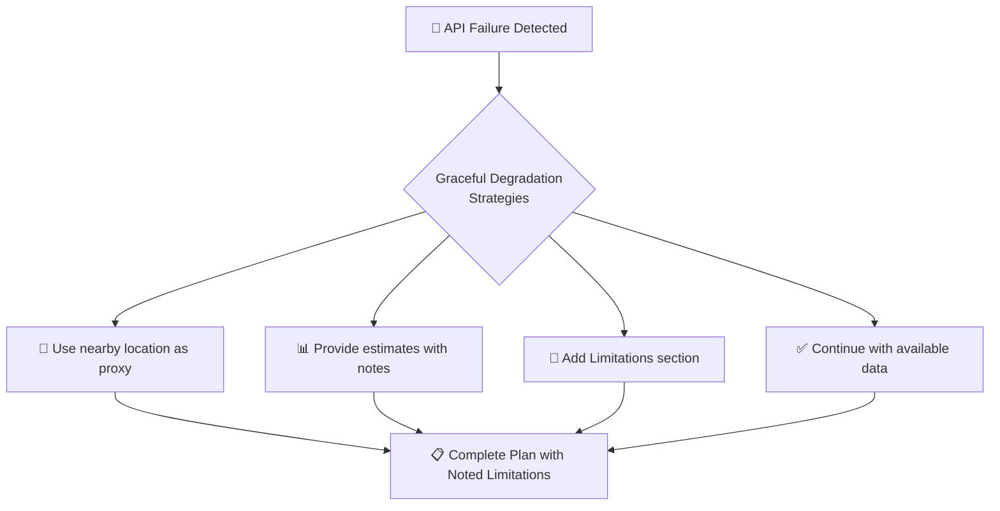

# Sri Lanka Travel Agent - Multi-Agent Architecture

## Overview

This travel planning system uses **Google Agent Development Kit (ADK)** multi-agent architecture with a **Coordinator/Dispatcher Pattern** for versatile, dynamic agent collaboration with **LLM-driven delegation**.

| Aspect | Details |
|--------|---------|
| **Framework** | Google Agent Development Kit (ADK) Python v0.1.0 |
| **Pattern** | Coordinator/Dispatcher with Sub-Agents |
| **Model** | Gemini 2.0 Flash |
| **APIs** | OpenWeatherMap, Google Maps, Google Places |

**Architecture**: Single Coordinator Pattern with `sub_agents` for intelligent `transfer_to_agent()` routing.

Based on: https://google.github.io/adk-docs/agents/multi-agents/

---

## System Architecture Diagram



---

## How It Works

### Request Flow



### Simple Query Example



### Complex Planning Example



### Dynamic Routing Examples

| User Query | Coordinator Transfers To | Reason |
|------------|--------------------------|--------|
| "Is it safe in Kandy?" | SafetyAgent only | Single-topic query |
| "What can I do in Galle?" | ActivityAgent only | Specific need |
| "Plan a beach vacation" | ActivityAgent + WeatherAgent + BudgetAgent | Multiple aspects |
| "Full 7-day itinerary" | All specialists + PlanReviewerAgent | Complete planning |

---

## Specialist Agents

| Agent | Description | Tools | API | Output Key |
|-------|-------------|-------|-----|------------|
| **🌤️ WeatherAgent** | Real-time weather conditions and forecasts | `get_weather`, `get_weather_forecast` | OpenWeatherMap | `weather_info` |
| **⚠️ SafetyAgent** | Travel advisories and health warnings | `get_safety_info`, `get_travel_advisory` | Google Places | `safety_info` |
| **🚗 RouteAgent** | Distances, travel times, directions | `get_route`, `get_directions`, `get_travel_options` | Google Maps | `route_info` |
| **💰 BudgetAgent** | Cost estimates and currency rates | `check_budget`, `get_currency_rate`, `compare_costs` | Google Places, Exchange Rate API | `budget_info` |
| **🎭 ActivityAgent** | Attractions and experiences | `get_activities`, `get_place_details` | Google Places | `activity_info` |
| **📋 PlanReviewerAgent** | Synthesizes all data into comprehensive itineraries | - | - | `draft_plan` |

---

## Agent Communication Patterns

### 1. Shared Session State

Agents communicate via session state keys:

```python
# Agent A saves data
context.state['weather_info'] = weather_data

# Agent B reads data
weather = context.state.get('weather_info')
```

### 2. Sub-Agents with transfer_to_agent()

Coordinator transfers control to specialists dynamically:

```python
travel_coordinator = LlmAgent(
    name="TravelCoordinator",
    sub_agents=[weather_agent, safety_agent, activity_agent, 
                route_agent, budget_agent, plan_reviewer_agent],
    # LLM can transfer to any sub-agent dynamically
)
```

**Within Coordinator's LLM context:**
```
transfer_to_agent(agent_name='WeatherAgent')  # LLM decides to transfer
# Control shifts to WeatherAgent
# WeatherAgent processes query, updates session state
# Control returns to TravelCoordinator
```

### 3. AgentTool (Explicit Invocation)

Alternative pattern for explicit tool-based invocation:

```python
weather_tool = AgentTool(agent=weather_agent)
coordinator = LlmAgent(
    name="TravelCoordinator",
    tools=[weather_tool],  # Invoke as tool
    # No parent-child relationship created - avoids Single Parent Rule
)
```

---
## Key Architecture Benefits

| Feature | Benefit |
|---------|---------|
| **LLM-Driven Delegation** | Intelligent routing via `transfer_to_agent()` |
| **Natural Conversation** | Multi-turn context with dynamic specialist access |
| **Flexible** | Handles simple queries to complex planning |
| **Scalable** | Easy to add new specialist agents |
| **Sub-Agent Hierarchy** | Clean parent-child relationships |
| **Graceful Degradation** | Completes plans even when some APIs fail |
| **Single Parent Rule Compliant** | AgentTool avoids parent-child conflicts |

---

## Review Workflow with Quality Assurance

The system includes an **Iterative Refinement Pattern** with built-in quality checking and graceful degradation for handling API failures and timeouts.

### Review Workflow Architecture



### Quality Checking Criteria

| Criteria | Pass Condition |
|----------|----------------|
| **Completeness** | Core requirements addressed (weather, safety, activities, routes, budget) |
| **Data Quality** | Has SOME real data from specialists (not all required) |
| **Structure** | Well-organized day-by-day itinerary |
| **Practicality** | Reasonable travel times and schedules |

**What Does NOT Cause Failure:**
- ❌ Missing data for specific locations when alternatives provided
- ❌ API errors that are noted and handled gracefully
- ❌ Estimated budgets when exact prices unavailable
- ❌ Using proxy weather data from nearby locations

### Graceful Degradation Strategy



| Failure | Graceful Response |
|---------|-------------------|
| Mirissa weather unavailable | Use Hikkaduwa (nearby) as proxy |
| Specific pricing fails | Provide budget ranges with note |
| Location not found | Suggest similar alternative |
| API timeout | Note limitation, continue with estimates |

### StopChecker: Loop Termination

The **StopChecker** agent ensures the workflow always completes:

```python
class StopChecker(BaseAgent):
    MAX_REFINEMENT_ATTEMPTS = 2  # Maximum iterations before forcing completion
    
    # Logic:
    # 1. If quality_status == "pass" → Stop and finalize
    # 2. If iterations >= MAX_REFINEMENT_ATTEMPTS → Force stop with limitations
    # 3. Otherwise → Continue refinement loop
```

| Condition | Message |
|-----------|---------|
| Quality Passed | ✅ Plan quality is sufficient after N iteration(s). Finalizing... |
| Max Iterations | ⚠️ Maximum refinement attempts (2) reached. Presenting best available plan... |
| Continuing | 🔄 Plan needs refinement (iteration N/2). Improving... |

---

## Usage Examples

### Python API

```python
from agents.orchestrator import simple_process, process_request

# Simple query
response = simple_process("What's the weather in Colombo?")
print(response)

# Complex planning with options
result = process_request(
    user_input="Plan a beach vacation in Sri Lanka",
    user_id="user_123",
    require_approval=False
)
print(result['response'])
```

### FastAPI Endpoints

```bash
# Simple planning
curl -X POST http://localhost:8000/plan \
  -H "Content-Type: application/json" \
  -d '{"query": "Plan a 3-day trip to Kandy"}'

# Quick query (faster)
curl -X POST http://localhost:8000/quick-plan \
  -H "Content-Type: application/json" \
  -d '{"query": "What is the weather in Ella?"}'
```

---

## Human-in-the-Loop Support

The system supports optional human approval workflows:

```python
# Submit for human review
result = process_request(query, require_approval=True)

# Process human decision
process_approval(request_id, decision="APPROVED", feedback="Looks good!")
```

| Decision | Proceed | Description |
|----------|---------|-------------|
| `APPROVED` | ✅ Yes | Plan is finalized as-is |
| `APPROVED_WITH_CHANGES` | ✅ Yes | Plan modified per human feedback |
| `REJECTED` | ❌ No | Plan rejected, reason provided |
| `REQUEST_CHANGES` | ❌ No | Human requests specific changes |

---

## API Endpoints

### Planning Endpoints

| Method | Endpoint | Description |
|--------|----------|-------------|
| `POST` | `/plan` | Full planning (with optional approval) |
| `POST` | `/quick-plan` | Quick planning without approval |

### Approval Endpoints

| Method | Endpoint | Description |
|--------|----------|-------------|
| `POST` | `/approve` | Submit approval decision |
| `GET` | `/pending-approvals` | List pending approvals |
| `GET` | `/approval-status/{id}` | Check approval status |

### Session Endpoints

| Method | Endpoint | Description |
|--------|----------|-------------|
| `GET` | `/session/{user_id}` | Get session state |
| `DELETE` | `/session/{user_id}` | Clear session |

---

## ADK Primitives Used

| Primitive | Usage |
|-----------|-------|
| **LlmAgent** | TravelCoordinator, all Specialist agents |
| **SequentialAgent** | ReviewWorkflow - step-by-step plan generation |
| **LoopAgent** | RefinementLoop - iterative quality improvement (max 2) |
| **BaseAgent** | StopChecker - custom loop termination logic |
| **ParallelAgent** | ParallelDataGatherer - concurrent specialist execution |
| **AgentTool** | Wraps specialists for tool-based invocation |
| **Runner** | Executes the coordinator workflow |
| **InMemorySessionService** | Session/state management |
| **Event/EventActions** | Custom events with escalation for loop control |

---

## File Structure

```
travel-agent/
├── main.py                      # FastAPI application entry point
├── requirements.txt             # Python dependencies
├── .env                         # Environment variables (API keys)
├── README.md                    # Project documentation
│
├── config/                      # Configuration
│   ├── __init__.py
│   └── settings.py              # Application settings
│
├── agents/                      # Agent definitions
│   ├── __init__.py
│   ├── agent.py                 # Root agent export for ADK
│   ├── orchestrator.py          # Multi-agent orchestrator & session management
│   ├── workflow.py              # TravelCoordinator with sub_agents
│   ├── review_workflow.py       # Review/Critique pattern with quality checking
│   └── specialists/             # Specialized domain agents
│       ├── __init__.py
│       ├── weather_agent.py     # Weather specialist (OpenWeatherMap)
│       ├── safety_agent.py      # Safety specialist (Google Places)
│       ├── route_agent.py       # Route planning (Google Maps)
│       ├── budget_agent.py      # Budget specialist (Exchange Rate API)
│       ├── activity_agent.py    # Activity finder (Google Places)
│       └── plan_reviewer_agent.py  # Plan synthesizer
│
├── tools/                       # Tool implementations
│   ├── __init__.py
│   ├── weather_tool.py          # OpenWeatherMap API integration
│   ├── safety_tool.py           # Safety info tools
│   ├── route_tool.py            # Google Maps Distance Matrix & Directions
│   ├── budget_tool.py           # Pricing and currency tools
│   ├── activity_tool.py         # Google Places API integration
│   ├── shared_context.py        # Shared state utilities
│   └── human_approval_tool.py   # Human-in-the-Loop approval system
│
└── docs/                        # Documentation
    ├── ARCHITECTURE.md          # This file
    ├── IMPROVEMENTS.md          # Future enhancements
    └── SUB_AGENTS_PATTERN.md    # Sub-agents pattern documentation
```

---

## Running the Application

### Method 1: ADK Web Interface (Recommended)

```bash
# Install dependencies
pip install -r requirements.txt

# Set environment variables in .env file
OPENWEATHER_API_KEY=your_key
GOOGLE_MAPS_API_KEY=your_key
GOOGLE_API_KEY=your_key

# Start ADK web server
adk web

# Open browser to http://127.0.0.1:8000
```

### Method 2: FastAPI Server

```bash
# Run the FastAPI API
python main.py
# or
uvicorn main:app --reload --port 8000

# Access API docs at http://localhost:8000/docs
```

### Method 3: Python Script

```python
from agents.orchestrator import simple_process

# Simple query
response = simple_process("What's the weather in Colombo?")
print(response)

# Complex planning
response = simple_process("Plan a 5-day trip to Sri Lanka")
print(response)
```

---

## Example Usage

### Via ADK Web Interface

1. Start ADK: `adk web`
2. Open http://127.0.0.1:8000
3. Type your query: "Plan a 3-day trip to Kandy and Ella"
4. Watch the coordinator dynamically call specialists
5. Receive comprehensive travel plan

### Via FastAPI

```bash
# Simple weather query
curl -X POST http://localhost:8000/plan \
  -H "Content-Type: application/json" \
  -d '{"query": "What is the weather in Colombo?"}'

# Full trip planning
curl -X POST http://localhost:8000/plan \
  -H "Content-Type: application/json" \
  -d '{
    "query": "Plan a 5-day cultural tour: Colombo, Kandy, Sigiriya. Budget traveler.",
    "user_id": "user123"
  }'

# Quick query (faster)
curl -X POST http://localhost:8000/quick-plan \
  -H "Content-Type: application/json" \
  -d '{"query": "How long from Colombo to Galle?"}'

# With human approval workflow
curl -X POST http://localhost:8000/plan \
  -H "Content-Type: application/json" \
  -d '{
    "query": "Plan a 5-day trip to Kandy and Sigiriya",
    "user_id": "user123",
    "require_approval": true
  }'
```

---

## Environment Variables

Required API keys in `.env`:

```bash
# OpenWeatherMap (free tier available)
OPENWEATHER_API_KEY=your_openweather_key

# Google Maps & Places
GOOGLE_MAPS_API_KEY=your_google_maps_key

# Google Gemini (for LLM agents)
GOOGLE_API_KEY=your_gemini_key
```

---

## Key Features

| Feature | Description |
|---------|-------------|
| ✅ **Dynamic LLM Routing** | Coordinator intelligently routes to specialists |
| ✅ **Parallel Execution** | Fast data gathering from multiple sources |
| ✅ **Natural Conversation** | Multi-turn dialogue with context preservation |
| ✅ **Real-time Data** | Weather, safety, routes, activities, budget |
| ✅ **Comprehensive Plans** | Day-by-day itineraries with all details |
| ✅ **Flexible Queries** | From simple questions to full trip planning |
| ✅ **Session Management** | Maintains conversation context across turns |
| ✅ **Human Approval** | Optional human-in-the-loop review workflow |
| ✅ **Graceful Degradation** | Handles API failures with fallback strategies |

---

## Architecture Advantages

| Advantage | Description |
|-----------|-------------|
| **Single Parent Rule Compliance** | AgentTool pattern avoids parent-child conflicts |
| **LLM Intelligence** | Gemini 2.0 Flash decides routing dynamically |
| **Efficiency** | ParallelAgent enables concurrent data collection |
| **Modularity** | Easy to add/remove specialist agents |
| **Scalability** | Coordinator pattern handles growing complexity |
| **Maintainability** | Clear separation of concerns between agents |
| **Quality Assurance** | Iterative refinement ensures plan quality |
| **Bounded Iterations** | Maximum refinement attempts prevent infinite loops |

---

## References

- [Google ADK Multi-Agent Systems](https://google.github.io/adk-docs/agents/multi-agents/)
- [Human-in-the-Loop Pattern](https://google.github.io/adk-docs/agents/multi-agents/#human-in-the-loop-pattern)
- [Review/Critique Pattern](https://google.github.io/adk-docs/agents/multi-agents/#reviewcritique-pattern-generator-critic)
- [Iterative Refinement Pattern](https://google.github.io/adk-docs/agents/multi-agents/#iterative-refinement-pattern)
- [Sequential Agents](https://google.github.io/adk-docs/agents/workflow-agents/sequential-agents/)
- [Parallel Agents](https://google.github.io/adk-docs/agents/workflow-agents/parallel-agents/)
- [Loop Agents](https://google.github.io/adk-docs/agents/workflow-agents/loop-agents/)

---

**Last Updated**: January 5, 2026  
**ADK Version**: Python v0.1.0  
**Patterns**: Coordinator/Dispatcher, Review/Critique, Iterative Refinement with Graceful Degradation
